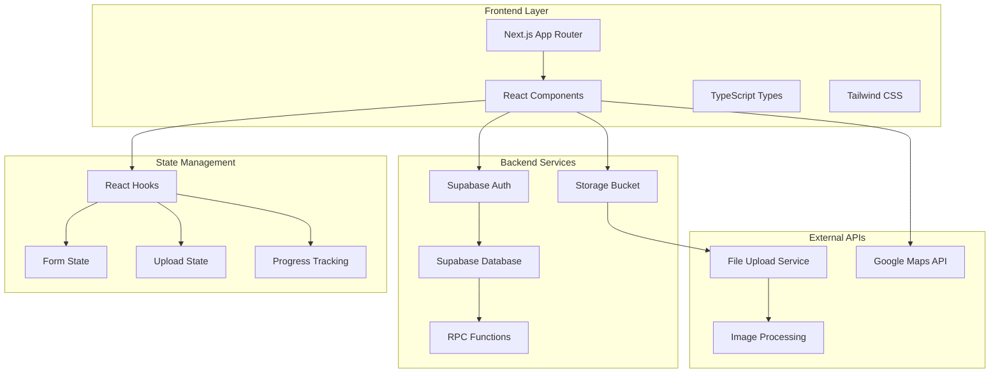

# Design Document

## Overview

The enhanced registration system will transform the existing Doña Repartos platform into a comprehensive, Rappi-inspired food delivery registration experience. The design focuses on creating intuitive multi-step registration flows, robust document management, and an enhanced menu builder while maintaining the existing brand identity and technical architecture.

The system will leverage the current Next.js 15 + TypeScript + Tailwind CSS + Supabase stack, extending it with new components, enhanced UI patterns, and improved user experience flows that match or exceed industry standards.

## Architecture

### High-Level Architecture



### Component Architecture

The design extends the existing component library with new specialized components:

- **Multi-step Forms**: `StepperForm`, `ProgressIndicator`, `StepNavigation`
- **Document Management**: `DocumentUploader`, `DocumentPreview`, `DocumentValidator`
- **Menu Builder**: `MenuItemEditor`, `CategoryManager`, `ImageUploader`
- **Enhanced UI**: `Card`, `Modal`, `Tooltip`, `Badge`, `Alert`

## Components and Interfaces

### Core Registration Components

#### 1. Multi-Step Registration Flow

```typescript
interface RegistrationStep {
  id: string;
  title: string;
  description: string;
  component: React.ComponentType<StepProps>;
  validation: ValidationSchema;
  isOptional?: boolean;
}

interface StepperFormProps {
  steps: RegistrationStep[];
  currentStep: number;
  onStepChange: (step: number) => void;
  onComplete: (data: FormData) => Promise<void>;
  allowSkipOptional?: boolean;
}
```

#### 2. Document Management System

```typescript
interface DocumentRequirement {
  id: string;
  name: string;
  description: string;
  required: boolean;
  acceptedFormats: string[];
  maxSize: number;
  validationRules: DocumentValidationRule[];
}

interface DocumentUploadProps {
  requirement: DocumentRequirement;
  onUpload: (file: File, metadata: DocumentMetadata) => Promise<UploadResult>;
  onRemove: (documentId: string) => void;
  existingDocument?: UploadedDocument;
}
```

#### 3. Menu Builder Interface

```typescript
interface MenuItem {
  id: string;
  name: string;
  description: string;
  price: number;
  category: string;
  image: string;
  ingredients?: string[];
  allergens?: string[];
  dietary?: DietaryInfo[];
  available: boolean;
}

interface MenuBuilderProps {
  items: MenuItem[];
  categories: MenuCategory[];
  onItemAdd: (item: Omit<MenuItem, 'id'>) => void;
  onItemUpdate: (id: string, updates: Partial<MenuItem>) => void;
  onItemRemove: (id: string) => void;
  onCategoryAdd: (category: MenuCategory) => void;
  minItems: number;
}
```

### Enhanced Form Components

#### 1. Smart Form Field with Enhanced Validation

```typescript
interface SmartFormFieldProps extends FormFieldProps {
  validationRules?: ValidationRule[];
  asyncValidation?: (value: string) => Promise<ValidationResult>;
  suggestions?: string[];
  formatters?: InputFormatter[];
  dependencies?: string[];
}
```

#### 2. Image Upload with Preview and Optimization

```typescript
interface ImageUploadProps {
  onUpload: (file: File) => Promise<string>;
  onRemove: () => void;
  requirements: ImageRequirements;
  preview?: string;
  aspectRatio?: number;
  cropEnabled?: boolean;
}

interface ImageRequirements {
  minWidth: number;
  minHeight: number;
  maxSize: number;
  formats: string[];
  preferredAspectRatio?: string;
}
```

### Registration Flow Designs

#### Restaurant Registration Flow

1. **Business Information Step**
   - Owner details
   - Restaurant name and type
   - Contact information
   - Real-time validation

2. **Location & Address Step**
   - Google Maps integration
   - Address autocomplete
   - Service area definition
   - Delivery zone mapping

3. **Legal Documentation Step**
   - Document upload interface
   - Validation and preview
   - Progress tracking
   - Help tooltips

4. **Branding & Media Step**
   - Logo upload with crop tool
   - Cover image upload
   - Brand color selection
   - Preview generation

5. **Menu Creation Step**
   - Category management
   - Item creation with rich editor
   - Image upload and optimization
   - Pricing and availability

6. **Review & Submit Step**
   - Complete information review
   - Terms acceptance
   - Final submission
   - Confirmation and next steps

#### Customer Registration Flow

1. **Personal Information**
   - Name and contact details
   - Email verification
   - Phone validation

2. **Address Setup**
   - Primary address with maps
   - Additional addresses
   - Delivery preferences

3. **Account Security**
   - Password creation
   - Security preferences
   - Notification settings

#### Delivery Driver Registration Flow

1. **Personal Information**
   - Identity verification
   - Contact details
   - Emergency contact

2. **Vehicle Information**
   - Vehicle type and details
   - Insurance information
   - License verification

3. **Documentation**
   - Driver's license upload
   - Vehicle registration
   - Insurance documents

4. **Background Check**
   - Consent forms
   - Background check initiation
   - Status tracking

## Data Models

### Enhanced User Models

```typescript
interface RestaurantProfile extends BaseProfile {
  restaurant_name: string;
  business_type: BusinessType;
  cuisine_types: string[];
  operating_hours: OperatingHours;
  delivery_radius: number;
  minimum_order: number;
  estimated_delivery_time: number;
  commission_rate: number;
  status: RestaurantStatus;
  documents: Document[];
  branding: RestaurantBranding;
  menu: MenuItem[];
}

interface Document {
  id: string;
  type: DocumentType;
  filename: string;
  url: string;
  status: DocumentStatus;
  uploaded_at: string;
  verified_at?: string;
  rejection_reason?: string;
}

interface RestaurantBranding {
  logo_url: string;
  cover_image_url: string;
  primary_color: string;
  secondary_color: string;
  description: string;
}
```

### Menu Management Models

```typescript
interface MenuCategory {
  id: string;
  name: string;
  description?: string;
  sort_order: number;
  is_active: boolean;
}

interface MenuItem {
  id: string;
  restaurant_id: string;
  category_id: string;
  name: string;
  description: string;
  price: number;
  image_url: string;
  ingredients: string[];
  allergens: Allergen[];
  dietary_info: DietaryInfo[];
  preparation_time: number;
  is_available: boolean;
  sort_order: number;
  created_at: string;
  updated_at: string;
}
```

## Error Handling

### Comprehensive Error Management

```typescript
interface ErrorHandler {
  handleValidationError: (error: ValidationError) => UserFriendlyError;
  handleUploadError: (error: UploadError) => UserFriendlyError;
  handleNetworkError: (error: NetworkError) => UserFriendlyError;
  handleAuthError: (error: AuthError) => UserFriendlyError;
}

interface UserFriendlyError {
  title: string;
  message: string;
  actionable: boolean;
  actions?: ErrorAction[];
  severity: 'info' | 'warning' | 'error';
}
```

### Error Recovery Strategies

1. **Automatic Retry**: Network failures, temporary server errors
2. **User Guidance**: Form validation errors, missing requirements
3. **Fallback Options**: Alternative upload methods, simplified flows
4. **Progress Preservation**: Save form state, resume capability

## Testing Strategy

### Component Testing

1. **Unit Tests**
   - Form validation logic
   - Data transformation functions
   - Utility functions
   - Custom hooks

2. **Integration Tests**
   - Multi-step form flows
   - File upload processes
   - API integration points
   - Authentication flows

3. **Visual Regression Tests**
   - Component rendering
   - Responsive layouts
   - Accessibility compliance
   - Cross-browser compatibility

### User Experience Testing

1. **Usability Testing**
   - Registration flow completion rates
   - Time to complete registration
   - Error recovery success
   - User satisfaction metrics

2. **Performance Testing**
   - Page load times
   - Image upload performance
   - Form submission speed
   - Mobile performance

3. **Accessibility Testing**
   - Screen reader compatibility
   - Keyboard navigation
   - Color contrast compliance
   - ARIA label accuracy

## UI/UX Design Patterns

### Design System Extensions

#### Color Palette
- Primary: `#e4007c` (Rappi-inspired pink)
- Secondary: `#00d4aa` (Success green)
- Warning: `#ff6b35` (Alert orange)
- Error: `#dc2626` (Error red)
- Neutral: Gray scale from `#f9fafb` to `#111827`

#### Typography Scale
- Headings: Inter font family, weights 400-800
- Body: Inter font family, weights 400-600
- Code: JetBrains Mono for technical content

#### Spacing System
- Base unit: 4px
- Scale: 4, 8, 12, 16, 20, 24, 32, 40, 48, 64, 80, 96

#### Component Variants

```typescript
interface ComponentVariants {
  size: 'sm' | 'md' | 'lg' | 'xl';
  variant: 'primary' | 'secondary' | 'outline' | 'ghost';
  state: 'default' | 'hover' | 'active' | 'disabled' | 'loading';
}
```

### Responsive Design Strategy

1. **Mobile-First Approach**
   - Base styles for mobile (320px+)
   - Progressive enhancement for larger screens
   - Touch-friendly interface elements

2. **Breakpoint System**
   - Mobile: 320px - 767px
   - Tablet: 768px - 1023px
   - Desktop: 1024px - 1439px
   - Large Desktop: 1440px+

3. **Adaptive Components**
   - Form layouts adjust to screen size
   - Navigation patterns change per device
   - Image sizes optimize for viewport

### Accessibility Enhancements

1. **WCAG 2.1 AA Compliance**
   - Color contrast ratios ≥ 4.5:1
   - Focus indicators on all interactive elements
   - Semantic HTML structure
   - Alternative text for images

2. **Keyboard Navigation**
   - Tab order follows logical flow
   - Skip links for main content
   - Escape key closes modals
   - Arrow keys for menu navigation

3. **Screen Reader Support**
   - ARIA labels and descriptions
   - Live regions for dynamic content
   - Proper heading hierarchy
   - Form field associations

## Performance Optimizations

### Frontend Optimizations

1. **Code Splitting**
   - Route-based splitting
   - Component lazy loading
   - Dynamic imports for heavy features

2. **Image Optimization**
   - Next.js Image component
   - WebP format with fallbacks
   - Responsive image sizes
   - Lazy loading implementation

3. **Bundle Optimization**
   - Tree shaking unused code
   - Minimize third-party dependencies
   - Optimize CSS delivery
   - Preload critical resources

### Backend Optimizations

1. **Database Performance**
   - Optimized RPC functions
   - Proper indexing strategy
   - Connection pooling
   - Query optimization

2. **File Upload Performance**
   - Direct-to-storage uploads
   - Progress tracking
   - Chunked uploads for large files
   - Image processing pipelines

## Security Considerations

### Data Protection

1. **Input Validation**
   - Client-side validation for UX
   - Server-side validation for security
   - SQL injection prevention
   - XSS protection

2. **File Upload Security**
   - File type validation
   - Size limitations
   - Virus scanning
   - Secure storage practices

3. **Authentication & Authorization**
   - JWT token management
   - Role-based access control
   - Session management
   - Password security requirements

### Privacy Compliance

1. **Data Minimization**
   - Collect only necessary information
   - Clear data retention policies
   - User consent management
   - Right to deletion

2. **Secure Transmission**
   - HTTPS enforcement
   - Encrypted data storage
   - Secure API endpoints
   - Certificate management