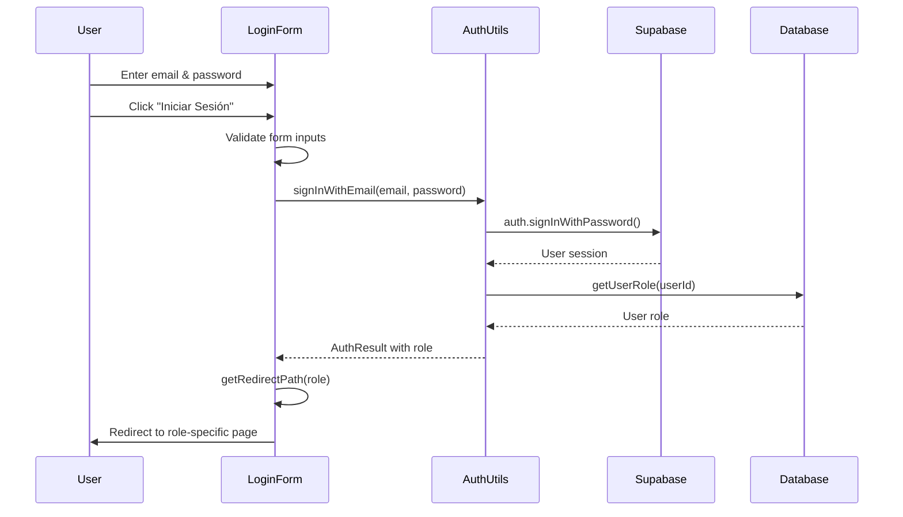
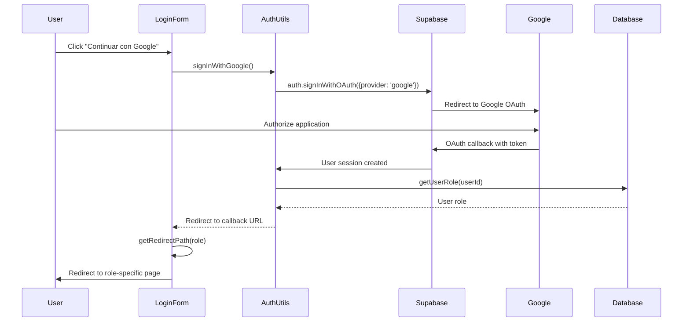

# Design Document

## Overview

This document outlines the design for implementing a login system using Supabase authentication. The system will provide a `/login` page that supports two authentication methods: email/password and Google OAuth. After successful authentication, users will be redirected to role-specific pages based on their assigned role (restaurant, admin, or client).

The design leverages the existing Supabase configuration and follows the project's established patterns for form components, accessibility, and responsive design.

## Architecture

### High-Level Architecture

```
┌─────────────────┐
│   Login Page    │
│   (/login)      │
└────────┬────────┘
         │
         ├──────────────────┬──────────────────┐
         │                  │                  │
         ▼                  ▼                  ▼
┌─────────────────┐  ┌──────────────┐  ┌──────────────┐
│ Email/Password  │  │ Google OAuth │  │ Form UI      │
│ Auth Handler    │  │ Handler      │  │ Components   │
└────────┬────────┘  └──────┬───────┘  └──────────────┘
         │                  │
         └──────────┬───────┘
                    │
                    ▼
         ┌──────────────────┐
         │ Supabase Client  │
         │ Authentication   │
         └────────┬─────────┘
                  │
                  ▼
         ┌──────────────────┐
         │ Session Created  │
         │ + Role Retrieved │
         └────────┬─────────┘
                  │
                  ▼
         ┌──────────────────┐
         │ Role-Based       │
         │ Redirect Logic   │
         └────────┬─────────┘
                  │
         ┌────────┴────────┬──────────────┐
         │                 │              │
         ▼                 ▼              ▼
┌────────────────┐  ┌──────────┐  ┌──────────┐
│ /restaurant    │  │ /admin   │  │ /client  │
│ Dashboard      │  │ Panel    │  │ Home     │
└────────────────┘  └──────────┘  └──────────┘
```

### Component Structure

```
app/
  login/
    page.tsx              # Main login page component
lib/
  supabase/
    auth.ts               # Authentication utilities and helpers
    client.ts             # Existing Supabase client (already exists)
types/
  auth.ts                 # Authentication-related types
  user.ts                 # User types (already exists, may need updates)
```

## Components and Interfaces

### 1. Login Page Component (`app/login/page.tsx`)

**Purpose**: Main page component that renders the login form and handles user interactions.

**Key Features**:
- Server component wrapper with client-side form component
- Responsive layout matching existing design system
- Accessibility compliant (WCAG 2.1 Level AA)
- Loading states and error handling

**Structure**:
```typescript
export default function LoginPage() {
  return (
    <div className="container">
      <LoginForm />
    </div>
  );
}
```

### 2. Login Form Component

**Purpose**: Client component that manages form state and authentication flow.

**State Management**:
```typescript
interface LoginFormState {
  email: string;
  password: string;
  isLoading: boolean;
  error: string | null;
  validationErrors: {
    email?: string;
    password?: string;
  };
}
```

**Key Methods**:
- `handleEmailLogin()`: Handles email/password authentication
- `handleGoogleLogin()`: Initiates Google OAuth flow
- `validateForm()`: Client-side form validation
- `handleRedirect()`: Role-based redirect after successful login

### 3. Authentication Utilities (`lib/supabase/auth.ts`)

**Purpose**: Centralized authentication logic and helper functions.

**Key Functions**:

```typescript
// Sign in with email and password
async function signInWithEmail(
  email: string, 
  password: string
): Promise<AuthResult>

// Sign in with Google OAuth
async function signInWithGoogle(): Promise<AuthResult>

// Get user role from database
async function getUserRole(userId: string): Promise<UserRole | null>

// Sign out current user
async function signOut(): Promise<void>

// Get current session
async function getSession(): Promise<Session | null>

// Redirect based on user role
function getRedirectPath(role: UserRole): string
```

**AuthResult Interface**:
```typescript
interface AuthResult {
  success: boolean;
  user?: User;
  role?: UserRole;
  error?: string;
}
```

### 4. Type Definitions (`types/auth.ts`)

```typescript
export type UserRole = 'restaurant' | 'admin' | 'client';

export interface AuthSession {
  user: User;
  role: UserRole;
  accessToken: string;
  refreshToken: string;
}

export interface LoginCredentials {
  email: string;
  password: string;
}

export interface AuthError {
  code: string;
  message: string;
  details?: string;
}
```

## Data Models

### User Profile Table Structure

The system assumes the following database structure exists in Supabase:

```sql
-- User profiles table (extends Supabase auth.users)
CREATE TABLE user_profiles (
  user_id UUID PRIMARY KEY REFERENCES auth.users(id),
  role TEXT NOT NULL CHECK (role IN ('restaurant', 'admin', 'client')),
  created_at TIMESTAMP WITH TIME ZONE DEFAULT NOW(),
  updated_at TIMESTAMP WITH TIME ZONE DEFAULT NOW()
);

-- Index for faster role lookups
CREATE INDEX idx_user_profiles_role ON user_profiles(role);
```

### Session Management

- Supabase handles session management automatically
- Sessions are stored in browser localStorage
- Access tokens are automatically refreshed
- Role information is fetched after authentication and stored in application state

## Authentication Flow

### Email/Password Login Flow



### Google OAuth Login Flow



## Error Handling

### Error Categories

1. **Validation Errors**: Client-side form validation
   - Empty email or password
   - Invalid email format
   - Password too short

2. **Authentication Errors**: Supabase authentication failures
   - Invalid credentials
   - User not found
   - Account locked/disabled

3. **Network Errors**: Connection issues
   - Timeout
   - No internet connection
   - Server unavailable

4. **Role Errors**: Missing or invalid role assignment
   - User has no role assigned
   - Invalid role value in database

### Error Display Strategy

- **Inline Errors**: Display validation errors below form fields using existing `ErrorMessage` component
- **Alert Errors**: Display authentication and network errors in an alert banner at the top of the form
- **Accessible Errors**: All errors announced to screen readers using ARIA live regions

### Error Messages

```typescript
const ERROR_MESSAGES = {
  INVALID_CREDENTIALS: 'Email o contraseña incorrectos',
  NETWORK_ERROR: 'Error de conexión. Por favor, verifica tu internet',
  NO_ROLE: 'Tu cuenta no tiene un rol asignado. Contacta al administrador',
  GOOGLE_CANCELLED: 'Inicio de sesión con Google cancelado',
  UNKNOWN_ERROR: 'Ocurrió un error inesperado. Intenta nuevamente',
};
```

## UI/UX Design

### Visual Design

The login page will follow the existing design system:

- **Colors**: 
  - Primary: `#e4007c` (pink)
  - Text: `#1f2937` (gray-800)
  - Background: `#f9fafb` (gray-50)
  - Error: `#ef4444` (red-500)
  - Success: `#10b981` (green-500)

- **Typography**: Inter font family (already loaded in layout)

- **Spacing**: Consistent with existing components using Tailwind spacing scale

### Layout Structure

```
┌─────────────────────────────────────────┐
│           Header (existing)             │
├─────────────────────────────────────────┤
│                                         │
│  ┌───────────────────────────────────┐  │
│  │                                   │  │
│  │   Logo / Title                    │  │
│  │   "Iniciar Sesión"                │  │
│  │                                   │  │
│  │   [Error Alert if present]        │  │
│  │                                   │  │
│  │   Email Input                     │  │
│  │   [email validation message]      │  │
│  │                                   │  │
│  │   Password Input                  │  │
│  │   [password validation message]   │  │
│  │                                   │  │
│  │   [Iniciar Sesión Button]         │  │
│  │                                   │  │
│  │   ─────── o ───────               │  │
│  │                                   │  │
│  │   [Continuar con Google Button]   │  │
│  │                                   │  │
│  │   ¿No tienes cuenta? Registrar    │  │
│  │                                   │  │
│  └───────────────────────────────────┘  │
│                                         │
├─────────────────────────────────────────┤
│           Footer (existing)             │
└─────────────────────────────────────────┘
```

### Responsive Breakpoints

- **Mobile**: 320px - 767px (single column, full width form)
- **Tablet**: 768px - 1023px (centered form, max-width 500px)
- **Desktop**: 1024px+ (centered form, max-width 450px)

### Accessibility Features

1. **Keyboard Navigation**:
   - Tab order: Email → Password → Login Button → Google Button → Register Link
   - Enter key submits form
   - Escape key clears errors

2. **Screen Reader Support**:
   - Proper ARIA labels on all inputs
   - ARIA live regions for error announcements
   - ARIA busy state during loading
   - Descriptive button labels

3. **Focus Management**:
   - Visible focus indicators (2px ring)
   - Focus trapped in form during loading
   - Focus moved to error message when validation fails

4. **Touch Targets**:
   - Minimum 44x44px touch targets (WCAG 2.1)
   - Adequate spacing between interactive elements

## Testing Strategy

### Unit Tests

1. **Authentication Utilities** (`lib/supabase/auth.ts`):
   - Test `signInWithEmail()` with valid credentials
   - Test `signInWithEmail()` with invalid credentials
   - Test `signInWithGoogle()` OAuth initiation
   - Test `getUserRole()` with existing user
   - Test `getUserRole()` with non-existent user
   - Test `getRedirectPath()` for each role

2. **Form Validation**:
   - Test email format validation
   - Test password length validation
   - Test empty field validation

### Integration Tests

1. **Login Flow**:
   - Test complete email/password login flow
   - Test complete Google OAuth flow
   - Test role-based redirect after login
   - Test error handling for failed authentication

2. **Session Management**:
   - Test session persistence after page reload
   - Test session expiration handling
   - Test logout functionality

### Accessibility Tests

1. **Keyboard Navigation**:
   - Test tab order through form
   - Test form submission with Enter key
   - Test focus management during loading

2. **Screen Reader**:
   - Test ARIA labels are present
   - Test error announcements
   - Test loading state announcements

### Manual Testing Checklist

- [ ] Login with valid email/password credentials
- [ ] Login with invalid credentials shows error
- [ ] Login with Google account
- [ ] Cancel Google OAuth flow
- [ ] Test on mobile device (iOS and Android)
- [ ] Test on tablet device
- [ ] Test on desktop browser (Chrome, Firefox, Safari)
- [ ] Test with screen reader (NVDA/JAWS)
- [ ] Test keyboard-only navigation
- [ ] Test with slow network connection
- [ ] Verify redirect for restaurant role
- [ ] Verify redirect for admin role
- [ ] Verify redirect for client role
- [ ] Verify error handling for user without role

## Security Considerations

1. **Password Handling**:
   - Passwords never stored in component state longer than necessary
   - No password logging or console output
   - Supabase handles password hashing and security

2. **Session Security**:
   - Supabase manages secure session tokens
   - Automatic token refresh
   - Secure HTTP-only cookies (when configured)

3. **OAuth Security**:
   - PKCE flow for OAuth (handled by Supabase)
   - State parameter validation
   - Redirect URI validation

4. **XSS Protection**:
   - All user input sanitized
   - React's built-in XSS protection
   - No dangerouslySetInnerHTML usage

5. **CSRF Protection**:
   - Supabase handles CSRF tokens
   - Same-site cookie policy

## Implementation Notes

### Dependencies

No new dependencies required. The implementation uses:
- `@supabase/supabase-js` (already installed)
- `next` (already installed)
- `react` (already installed)
- Existing UI components from the project

### Environment Variables

Already configured in `.env.local`:
- `NEXT_PUBLIC_SUPABASE_URL`
- `NEXT_PUBLIC_SUPABASE_ANON_KEY`

### Redirect URLs Configuration

The following redirect URLs must be configured in Supabase Dashboard:
- Development: `http://localhost:3000/login`
- Production: `https://yourdomain.com/login`

### Role Assignment

The system assumes users already have roles assigned in the `user_profiles` table. Role assignment during registration is outside the scope of this feature but should be handled by:
- Restaurant registration flow (existing)
- Client registration flow (to be implemented)
- Admin assignment (manual or separate admin tool)

## Future Enhancements

1. **Password Reset**: Add "Forgot Password" link and flow
2. **Remember Me**: Optional persistent session
3. **Two-Factor Authentication**: Add 2FA support
4. **Social Login**: Add more OAuth providers (Facebook, Apple)
5. **Login Analytics**: Track login attempts and success rates
6. **Rate Limiting**: Prevent brute force attacks
7. **Magic Link**: Passwordless email authentication
